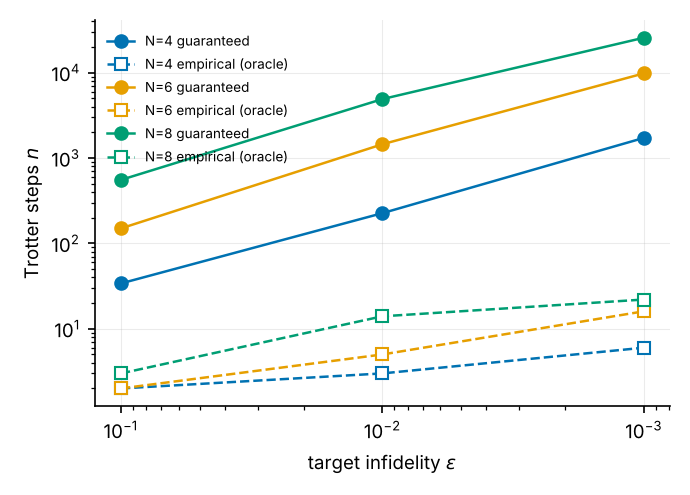
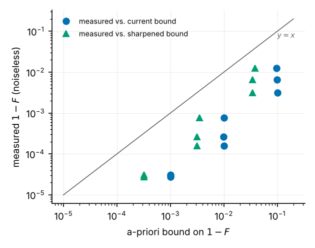
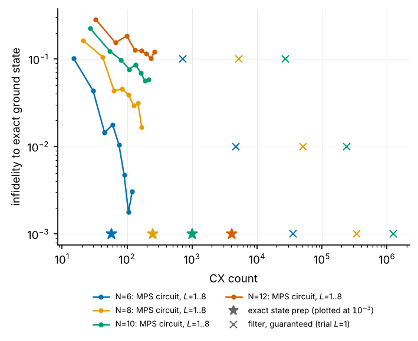
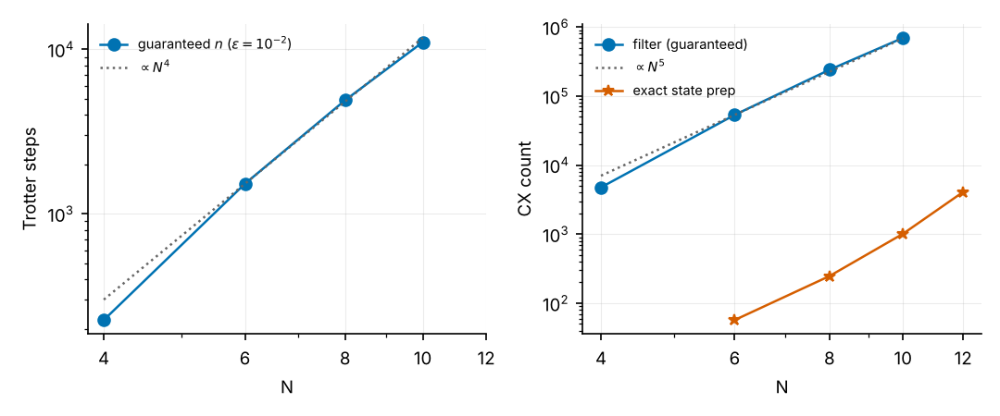
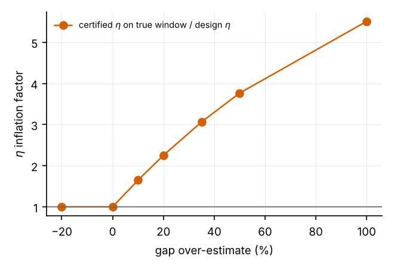

## 5. Verification and results

All experiments use noiseless exact statevector (or exact-unitary) simulation, $J_1=1$, open boundaries, a one-layer ($L=1$) brickwork trial circuit from the DMRG MPS unless stated, and the pipeline defaults (first-order Lie–Trotter, ED spectrum, `floor` design). DMRG: two-site, bond dimensions $\{8,16,32,64,64\}$, cutoff and tolerance $10^{-10}$ (quimb 1.15; qiskit 2.5.2; `mps-to-circuit`, Python 3.12). Environment note: `mps-to-circuit` does not install on Python ≥ 3.13.

### 5.1 The analytic building blocks hold

| Check | Test | Result |
|---|---|---|
| Pulse convention | random non-commuting $H$, random complex $\psi$, $\phi\to-\phi$ rejected | errors $<10^{-8}$ (code's own check) |
| R1 certificates | 60 random designs vs. $2\times10^6$-point brute-force sup | 0 violations; branch-and-bound/brute $\in[1.0000002,\,1.0023]$; grid+Lipschitz $\in[1.000006,\,1.0013]$ |
| R2 leakage bound | $2\times10^4$ random spectra, trial states, filters | 0 violations |
| $\alpha$ (commutator constant) | dense commutator norms, $N=4$–$6$, both term orders | code equals dense value to $10^{-15}$; the triangle-inequality value is up to 40 % larger at $J_2\neq0$ |
| Lie–Trotter pulse error | $\|\mathcal W-\widetilde{\mathcal W}\|$ for $H\otimes Z$, $N=4$, $t\le 6$, $k\le20$; system-level first-order error, $N=4$–$6$ | pulse level always $\le 0.24\times$ the bound; system level $\le0.47\times$ |
| Composition R4 and sharpened version | $5\times10^4$ random unit-vector triples | 0 violations of either; sharpened is 2.2× tighter on median |
| Normalisation lemma $\sin\angle(a,b)\le\|a-b\|/\|a\|$ | $5\times10^4$ random pairs | 0 violations (max ratio 0.99999) |

The Lie–Trotter ordering that qiskit realises with `preserve_order=True` was identified by explicit comparison with both ordered products (forward matches to $<10^{-9}$); the code nevertheless takes the maximum of the two orderings, which is safe.

### 5.2 Guaranteed versus empirical, and tightness of the bound

{width=70%}

| $N$ | $\varepsilon$ | $n_{\mathrm{guar}}$ | $n_{\mathrm{emp}}$ | ratio | bound $1-F$ | measured $1-F$ at $n_{\mathrm{guar}}$ | sharpened bound | $n_{\mathrm{guar}}^{\mathrm{sharp}}$ | CX guar. | CX emp. |
|---|---|---|---|---|---|---|---|---|---|---|
| 4 | $10^{-1}$ | 34 | 2 | 17 | 0.0999 | 3.2e-3 | 0.035 | 14 | 723 | 51 |
| 4 | $10^{-2}$ | 226 | 3 | 75 | 0.0100 | 2.7e-4 | 3.2e-3 | 100 | 4 755 | 72 |
| 4 | $10^{-3}$ | 1 719 | 6 | 287 | 0.0010 | 3.1e-5 | 3.2e-4 | 760 | 36 108 | 135 |
| 6 | $10^{-1}$ | 150 | 2 | 75 | 0.0996 | 6.6e-3 | 0.034 | 60 | 5 265 | 85 |
| 6 | $10^{-2}$ | 1 450 | 5 | 290 | 0.0100 | 7.6e-4 | 3.5e-3 | 589 | 50 765 | 190 |
| 6 | $10^{-3}$ | 9 797 | 16 | 612 | 0.0010 | 2.8e-5 | 3.2e-4 | 4 328 | 342 910 | 575 |
| 8 | $10^{-1}$ | 555 | 3 | 185 | 0.0962 | 1.2e-2 | 0.038 | 175 | 27 216 | 168 |
| 8 | $10^{-2}$ | 4 903 | 14 | 350 | 0.0100 | 1.6e-4 | 3.2e-3 | 2 164 | 240 268 | 707 |
| 8 | $10^{-3}$ | 25 634 | 22 | 1 165 | 0.0010 | (not simulated) | – | 11 317 | 1 256 087 | 1 099 |

($J_2=0$, $L=1$, floor design. $n_{\mathrm{guar}}^{\mathrm{sharp}}$ is the a-priori step number if the sharpened composition of §3 replaced R4, computed on the un-gridded design, i.e. indicative.)

Three observations.

*(a) The guarantee is sound but loose.* No design violated its bound. The measured infidelity at $n_{\mathrm{guar}}$ is 8–63× below the bound, and the sharpened composition (valid in every case) tightens the bound by 2.5–3.1× and reduces the a-priori $n$ by 2.3–3.2×. Two further sources of slack remain: the commutator norm is a worst case over the full Hilbert space (the pulse-level operator error is already only $\le 0.24$ of the bound, §5.1) and the state error on low-energy states is far smaller than the operator error (measured state error $2\times10^{-4}$ vs. bound $5.6\times10^{-2}$ at $N=6$, $\varepsilon=10^{-2}$).

{width=55%}

*(b) The “empirical” point is an oracle and sometimes not a filter at all.* $n_{\mathrm{emp}}$ is defined by comparison with the exact ground state. In several rows (e.g. $N=6$, $\varepsilon=10^{-1},10^{-2}$; $N=8$, $\varepsilon=10^{-1}$) the certified $\eta$ at $n_{\mathrm{emp}}$ is $\approx1$: the snapped Trotter step ($dt\approx3.6$ in scaled units, i.e. $W\,dt\approx13$ rad) is so coarse that the circuit is no longer an approximation of the designed filter, and the measured improvement is a property of that particular discretisation, not something a bound can certify or a user could know a priori. The empirical numbers should be presented as a lower envelope, not as the algorithm's cost.

*(c) Cost.* The guaranteed circuits for $N=6$ at $\varepsilon=10^{-2}$ have 1450 Trotter steps, 50 765 CX, depth $\approx2\times10^{5}$ and $\approx7\times10^{4}$ non-Clifford rotations, i.e. $\sim1.4\times10^{6}$ T gates under the code's own synthesis estimate, with success probability $P_{\mathrm{succ}}\approx0.72$.

### 5.3 Is the filter worth it? Baselines

{width=70%}

Exact preparation of the ED ground state with qiskit's generic isometry synthesis costs 57, 247, 1013 and 4083 CX for $N=6,8,10,12$ ($\approx2^{N}$). The guaranteed filter at $\varepsilon=10^{-2}$ costs 50 765, 240 268 and 696 807 CX for $N=6,8,10$, i.e. **890×, 970× and 690×** more than exact preparation, and 2–3 orders of magnitude more than the entire $L\le8$ MPS-circuit family (15–264 CX). The MPS-circuit baseline is itself imperfect and *non-monotone in $L$* (e.g. $N=6$: infidelity $1.4\times10^{-2}$ at $L=3$, $1.8\times10^{-2}$ at $L=4$; the compilation is a local optimisation), and at $N=10,12$ it has not converged by $L=8$ (5.8 % and 12 % infidelity). Extrapolating the fitted $N^5$ filter cost against the $2^N$ exact cost suggests a crossover near $N\approx26$ — but dense isometry synthesis is not available at that size and the extrapolation ignores the decay of $\gamma$ with $N$; the relevant comparators there are MPS-based sequential preparation [7] and QETU/Lin–Tong filters [5,6]. The full equal-fidelity comparison with the `mps-to-circuit` approximate and sequential circuits, for $N=6$–$12$ and $J_2\in\{0,0.4\}$, is given in §5.8.

### 5.4 Scaling with system size

Guaranteed $n$ for $N=4,6,8,10$: 226, 1523, 4903, 11 060 (fit exponent 4.3 over 4–10, 3.9 over 6–10); CX: $4.8\times10^3$, $5.3\times10^4$, $2.4\times10^5$, $7.0\times10^5$ (exponent 5.0–5.5). This agrees with the structure of the bound, $n\propto\alpha_{\mathrm{phys}}T_{\mathrm{phys}}^{2}/(\sqrt{p_g}\,d_T)$ with $\alpha_{\mathrm{phys}}\propto N$ (3.0, 4.5, 6.0 for $N=6,8,10$ at $J_2=0$), $T_{\mathrm{phys}}\propto1/\Delta_{\mathrm{gap}}\propto N$ (gap 0.49, 0.39, 0.33) giving $N^3$, with the remaining power from $\gamma(N)$ falling at fixed $L$ (0.90, 0.84, 0.78) and hence tighter $\eta_*$, plus the per-step CX growing $\propto N$. (Note that rescaling by $W$ cancels: $\alpha T^2$ is $W$-independent.) Using $L=3$ trial layers raises $\gamma$ (0.98, 0.94, 0.90 for $N=6,8,10$) and lowers guaranteed CX by 3.2×, 1.7× and 1.5× respectively: the benefit of a better trial state shrinks with $N$ because the evolution time $T\propto1/\Delta_{\mathrm{gap}}$ is set by the gap, not by $\gamma$.

### 5.5 The DMRG-derived inputs

| $N$ | $|\Delta E_0|$ | $\Delta E_1=E_1^{\mathrm{DMRG}}-E_1$ | rel. gap error | $|\Delta E_{\mathrm{top}}|$ | $\mathrm{Var}(H)$ | $|\langle\psi_{\mathrm{DMRG}}|E_0\rangle|^2$ |
|---|---|---|---|---|---|---|
| 6 | 3e-15 | −4e-16 | −7e-15 | 3e-15 | ≈0 | 1.0 |
| 8 | 2e-15 | 2e-15 | 1e-15 | 5e-15 | ≈0 | 1.0 |
| 10 | 5e-10 | 3.5e-10 | −3.7e-10 | 3e-13 | 2.5e-9 | 1.0 |
| 12 | 1.2e-9 | 9.3e-10 | −8.5e-10 | 4e-12 | 5.8e-9 | 1.0 |
| 14 | 1.8e-9 | 1.3e-9 | −2.0e-9 | 7e-12 | 8.3e-9 | 1.0 |
| 16 | 2.2e-9 | 2.4e-9 | 7e-10 | 1e-11 | 1.0e-8 | 1.0 |

($J_2=0$. Rows with ≈0 variance are at rounding level. $J_2=0.2411$ ($N=6$–$16$) and $J_2=0.5$ ($N=6$–$10$) show the same behaviour: $|\Delta E_0|,|\Delta E_1|\le2.6\times10^{-9}$, overlap 1; the full table is in `results/exp3a_*.json`, which is written when the sweep finishes.) DMRG reproduces $E_0$, $E_1$ and $E_{\mathrm{top}}$ to $\lesssim2\times10^{-9}$ and the ground state to overlap 1 against sparse-Lanczos ED up to $N=16$. Three caveats are relevant to certification, not to accuracy:

1. $\Delta E_1\ge0$ (up to rounding), as expected for a variational excited-state energy — the **unsafe direction** for a gap used as a *lower* bound. The size is negligible here, but nothing guarantees it for large $N$ or frustrated $J_2$.
2. The relative gap error changes sign, so the sign of the error is not controlled either.
3. The code's $e_0=\sqrt{\mathrm{Var}H}/W$ (e.g. $10^{-4}/W$ at $N=16$) is five orders of magnitude larger than the true energy error ($2\times10^{-9}$): it is simultaneously non-rigorous (an eigenvalue within $\sqrt{\mathrm{Var}}$ need not be the lowest) and wasteful (it enters $|F(E_0)|\ge|F(0)|-Le_0$). A Temple-type lower bound $E_0\ge\langle H\rangle-\mathrm{Var}/(\tilde E_1-\langle H\rangle)$, which is *quadratically* smaller, becomes available as soon as a rigorous lower bound $\tilde E_1$ on the first excitation is accepted — the same quantity the certificate already needs.

(The DMRG penalty state $\psi_1$ has weight 0.03–0.56 on any *single* ED vector at $E_1$ because $E_1$ is a threefold-degenerate triplet; this is not an error.)

### 5.6 Over-estimating the gap, and what symmetry could buy

We designed filters for a gap over-estimated by $s\in\{-20\%,\dots,+100\%\}$ ($N=6$, $J_2=0$, $\varepsilon_\ell=10^{-3}$) and evaluated them on the true spectrum.

{width=55%}

The certificate fails as soon as the design gap exceeds the true one: certified $\eta$ on the true window rises from 0.092 to 0.15, 0.21, 0.28, 0.34 and 0.50 for $s=10,20,35,50,100\%$ (design target 0.092). The *measured* leakage of this particular trial state nevertheless stays below the $10^{-3}$ target ($\le7\times10^{-4}$). The reason is symmetry: the $L=1$ trial state has 96.3 % of its weight in $S=0$, 0.49 % in $S=1$, 3.2 % in $S=2$, and the triplet that fixes the gap carries almost none of it, while the first $S=0$ excitation lies at 2.66× the triplet gap ($N=6$, $J_2=0$). A rigorous statement therefore needs the sector weights, which suggests a concrete improvement (§6): because every bond exponential is SU(2)-symmetric ("bond" ordering) the Trotterised evolution preserves $S$, so one may certify with sector-dependent windows. The potential saving, since $n\propto\Delta^{-2}$, is $(\Delta_{\mathrm{sector}}/\Delta_{\mathrm{any}})^2$:

| $J_2$ | $N=6$ | $N=8$ | $N=10$ |
|---|---|---|---|
| 0 | 7.1× | 7.0× | 6.9× |
| 0.2411 | 4.2× | 4.1× | 4.1× |
| 0.5 | 1.8× | 1.6× | 1.4× |

(ratio $(\Delta_{\mathrm{sector}}/\Delta_{\mathrm{any}})^2$ from exact diagonalisation; $N=12$, $J_2=0$: 6.8×.)

### 5.7 The $J_2=0.5$ case is trivial, and exposes a defect

At the Majumdar–Ghosh point the open even chain has the product-of-dimers ground state [8], which a single brickwork layer reproduces exactly: we find $\gamma=1$ (to double precision) for $N=4$–$12$. `floor_vs_precision` then correctly returns "no filter needed" rows ($m=0$), but `choose_floor_design` counts them as infeasible and `make_design` silently falls back to the legacy `builder` design with a hard-coded $P_{\mathrm{succ}}\ge0.9$. The pipeline then reports guaranteed circuits of 24 261, 511 068 and 1 157 409 CX for $N=4,8,10$ to prepare a state it already has, and the oracle-empirical search "meets" $\varepsilon=0.1$ with a state that has *lost* 9 % fidelity. The near-MG regime is therefore a poor benchmark for the algorithm; the interesting frustrated regime is $J_2\sim0.3$–$0.45$ or non-dimerised trial limits (small $L$ at larger $N$).
