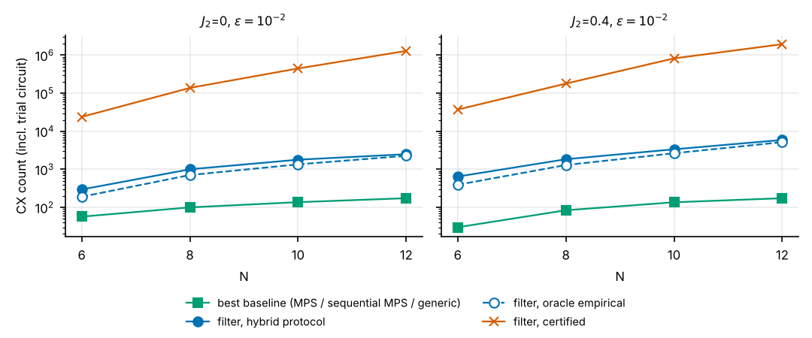

### 5.8 Baselines at equal fidelity: the filter does not beat MPS preparation here

Table 5.8 lists, for each target $\varepsilon$, the cheapest baseline that reaches it (measured against the exact ground state) next to the filter's cost (including the trial circuit): the *certified* design of §3 and the *hybrid protocol* of §5.10.

| $N$ | $J_2$ | $\varepsilon$ | best baseline (CX) | filter: certified (CX) | filter: hybrid protocol (CX) | certified / baseline | hybrid / baseline |
|---|---|---|---|---|---|---|---|
| 6 | 0 | 0.1 | MPS circuit (30) | 4,000 | 155 | 133× | 5.2× |
| 6 | 0 | 0.01 | generic prep (57) | 23,880 | 295 | 419× | 5.2× |
| 6 | 0 | 0.001 | generic prep (57) | 215,260 | 715 | 3776× | 13× |
| 8 | 0 | 0.1 | MPS circuit (63) | 14,861 | 315 | 236× | 5.0× |
| 8 | 0 | 0.01 | sequential MPS (100) | 137,998 | 1,001 | 1380× | 10× |
| 8 | 0 | 0.001 | generic prep (247) | 1,066,499 | 2,765 | 4318× | 11× |
| 10 | 0 | 0.1 | MPS circuit (81) | 43,551 | 783 | 538× | 9.7× |
| 10 | 0 | 0.01 | sequential MPS (137) | 447,822 | 1,791 | 3269× | 13× |
| 10 | 0 | 0.001 | sequential MPS (519) | 3,802,824 | 3,051 | 7327× | 5.9× |
| 12 | 0 | 0.1 | sequential MPS (174) | 125,532 | 1,573 | 721× | 9.0× |
| 12 | 0 | 0.01 | sequential MPS (174) | 1,292,390 | 2,497 | 7428× | 14× |
| 12 | 0 | 0.001 | sequential MPS (709) | – | 7,425 | – | 10× |
| 6 | 0.4 | 0.1 | MPS circuit (15) | 9,117 | 330 | 608× | 22× |
| 6 | 0.4 | 0.01 | MPS circuit (30) | 37,215 | 645 | 1240× | 22× |
| 6 | 0.4 | 0.001 | generic prep (57) | 285,372 | 1,779 | 5007× | 31× |
| 8 | 0.4 | 0.1 | MPS circuit (21) | 36,554 | 567 | 1741× | 27× |
| 8 | 0.4 | 0.01 | MPS circuit (84) | 178,878 | 1,841 | 2130× | 22× |
| 8 | 0.4 | 0.001 | sequential MPS (99) | 1,828,526 | 7,301 | 18470× | 74× |
| 10 | 0.4 | 0.1 | MPS circuit (27) | 100,755 | 1,455 | 3732× | 54× |
| 10 | 0.4 | 0.01 | sequential MPS (136) | 823,204 | 3,359 | 6053× | 25× |
| 10 | 0.4 | 0.001 | sequential MPS (136) | 6,707,397 | 11,451 | 49319× | 84× |
| 12 | 0.4 | 0.1 | MPS circuit (33) | 249,852 | 1,797 | 7571× | 54× |
| 12 | 0.4 | 0.01 | sequential MPS (174) | 1,943,145 | 5,913 | 11168× | 34× |
| 12 | 0.4 | 0.001 | sequential MPS (174) | 17,365,356 | 37,665 | 99801× | 216× |

The best baseline is an MPS-based circuit with bond dimension $\chi\le8$ in nearly every row; generic preparation wins only at the smallest sizes and tightest targets ($N\le8$). The sequential MPS method needs $\chi=4$ for $\varepsilon=10^{-2}$ at every $N=6$–$12$ and its cost grows slowly (63–174 CX); for $J_2=0.4$ the state is nearly a dimer product and $\chi=2$ already gives $\varepsilon\lesssim10^{-1}$ for 15–33 CX. The certified filter is $10^{2}$–$10^{4}\times$ more expensive and the gap *widens* with $N$ (figure 7). The hybrid protocol closes most of the gap but, at these sizes, remains 5–216× above the best baseline (median ≈22×; largest at tight $\varepsilon$ and large $N$, where the hybrid step count itself grows).

### 5.9 Where the certified-versus-empirical gap comes from

The worst-case constant $\alpha=\sum_g\|[H_g,\sum_{g'>g}H_{g'}]\|$ is an operator norm over the whole Hilbert space. The first-order Lie–Trotter error vector acting on a state $\psi$ is $\tfrac{t^2}{2k}C\psi$ with $C=\sum_{g<g'}[H_{g'},H_g]$ (anti-Hermitian), so what a low-energy state actually feels is $\|C\psi\|$, not $\alpha$:

| $N$ | $J_2$ | $\alpha$ (worst case) | $\|C\psi_0\|$ (ground state) | $\alpha/\|C\psi_0\|$ | $\alpha/\|C\psi_{E_1}\|$ |
|---|---|---|---|---|---|
| 4 | 0 | 0.2679 | 0.0000 | (=0) | 2.3 |
| 6 | 0 | 0.2141 | 0.0075 | 28.5 | 4.8 |
| 8 | 0 | 0.1713 | 0.0050 | 34.1 | 7.9 |
| 10 | 0 | 0.1417 | 0.0034 | 41.2 | 11.6 |
| 4 | 0.4 | 0.4177 | 0.0574 | 7.3 | 3.5 |
| 6 | 0.4 | 0.3480 | 0.0369 | 9.4 | 6.4 |
| 8 | 0.4 | 0.2832 | 0.0251 | 11.3 | 9.0 |
| 10 | 0.4 | 0.2361 | 0.0184 | 12.8 | 11.2 |

($H$ scaled by $W$; for $N=4$, $J_2=0$ the ground state is annihilated by $C$.) The ground state feels a first-order error coefficient 28–41× below $\alpha$ at $J_2=0$ and 9–13× below at $J_2=0.4$, and the ratio *grows* with $N$ ($\alpha$ grows linearly while $\|C\psi_0\|$ falls), so the bound becomes looser, not tighter, as the system grows. Combined with the pulse-level slack ($\le0.24$ of the bound, §5.1) and the factor $\approx2$ of the original composition, this accounts for the measured $\approx270\times$ gap between predicted and observed state error at $N=6$ ($28\times4\times2\approx240$). The measured state error scales as $1/n$ exactly as the first-order theory predicts, only with a much smaller constant: the oracle-empirical step counts are therefore *consistent with* the theory, not evidence against it.

### 5.10 A hybrid, non-oracle protocol: rigorous leakage plus empirical Trotter control

The "empirical" step counts of §5.2 use the exact ground state and are not available to a user. We therefore replace them by a protocol that uses only quantities a practitioner can obtain:

1. **Leakage — rigorous.** For the snapped step grid, certify $\eta$ (R1) and compute the leakage bound $\ell(n)$ from R2 (needs $\gamma$ and $\Delta$).
2. **Trotter — empirical, Richardson-type.** Run the same circuit family at $n$ and $2n$ and compute $\delta_n=1-|\langle\psi_n|\psi_{2n}\rangle|^2$; because the error vector scales as $1/n$, the distance to the $n\to\infty$ state is $\approx2\sqrt{\delta_n}$.
3. **Accept** the smallest $n$ on a geometric grid with $(\sqrt{\ell(n)}+2\sqrt{\delta_n})^2\le\varepsilon$ and certified $\eta<1$.

The exact ground state is used only afterwards, to validate. (On hardware the two-run comparison is replaced by the convergence of an energy or other observable estimated at $n$ and $2n$.) Results ($L=1$ trial, $J_1=1$; rows for $N=10$ ($\varepsilon=10^{-3}$) and $N=12$ ($J_2=0$) were rerun with the full floor-search settings (6 leakage fractions, $m\in\{4,6,8\}$), which found a feasible `floor` design in every case, so no row uses the legacy `builder` fallback; † would mark such a row. The floor search is a heuristic local optimiser, so costs for the same target can differ by tens of percent between search settings (e.g. certified CX at $N=12$, $\varepsilon=10^{-2}$: 1.29M with the reduced search of §5.8 versus 1.67M here)):

| $N$ | $J_2$ | $\varepsilon$ | $n$ (protocol) | CX | measured $1-F$ | $P_{\rm succ}$ | oracle $n$ / CX | certified $n$ / CX | certified ÷ protocol (CX) |
|---|---|---|---|---|---|---|---|---|---|
| 6 | 0 | 0.1 | 4 | 155 | 0.015 | 0.58 | 2 / 85 | 150 / 5,265 | 34× |
| 6 | 0 | 0.01 | 8 | 295 | 0.00099 | 0.6 | 5 / 190 | 1523 / 53,320 | 181× |
| 6 | 0 | 0.001 | 20 | 715 | 0.00036 | 0.55 | 16 / 575 | 10286 / 360,025 | 504× |
| 8 | 0 | 0.1 | 6 | 315 | 0.023 | 0.53 | 3 / 168 | 555 / 27,216 | 86× |
| 8 | 0 | 0.01 | 20 | 1,001 | 0.00092 | 0.54 | 14 / 707 | 4903 / 240,268 | 240× |
| 8 | 0 | 0.001 | 56 | 2,765 | 0.00022 | 0.54 | 25 / 1,246 | 32653 / 1,600,018 | 579× |
| 10 | 0 | 0.1 | 12 | 783 | 0.0064 | 0.44 | 7 / 468 | 1212 / 76,383 | 98× |
| 10 | 0 | 0.01 | 28 | 1,791 | 0.0013 | 0.51 | 21 / 1,350 | 11060 / 696,807 | 389× |
| 10 | 0 | 0.001 | 48 | 3,051 | 0.0004 | 0.45 | 36 / 2,295 | 61683 / 3,886,056 | 1274× |
| 12 | 0 | 0.1 | 20 | 1,573 | 0.0071 | 0.55 | 7 / 572 | 2673 / 205,854 | 131× |
| 12 | 0 | 0.01 | 32 | 2,497 | 0.0015 | 0.48 | 29 / 2,266 | 21651 / 1,667,160 | 668× |
| 12 | 0 | 0.001 | 96 | 7,425 | 0.00019 | 0.52 | 44 / 3,421 | 119858 / 9,229,099 | 1243× |
| 6 | 0.4 | 0.1 | 5 | 330 | 0.014 | 0.91 | 3 / 204 | 177 / 11,166 | 34× |
| 6 | 0.4 | 0.01 | 10 | 645 | 0.0028 | 0.55 | 6 / 393 | 882 / 55,581 | 86× |
| 6 | 0.4 | 0.001 | 28 | 1,779 | 0.00053 | 0.49 | 22 / 1,401 | 8323 / 524,364 | 295× |
| 8 | 0.4 | 0.1 | 6 | 567 | 0.015 | 0.88 | 4 / 385 | 518 / 47,159 | 83× |
| 8 | 0.4 | 0.01 | 20 | 1,841 | 0.0046 | 0.53 | 14 / 1,295 | 3128 / 284,669 | 155× |
| 8 | 0.4 | 0.001 | 80 | 7,301 | 0.00043 | 0.8 | 54 / 4,935 | 28715 / 2,613,086 | 358× |
| 10 | 0.4 | 0.1 | 12 | 1,455 | 0.0076 | 0.79 | 5 / 622 | 1051 / 125,096 | 86× |
| 10 | 0.4 | 0.01 | 28 | 3,359 | 0.006 | 0.66 | 22 / 2,645 | 8251 / 981,896 | 292× |
| 10 | 0.4 | 0.001 | 96 | 11,451 | 0.00054 | 0.8 | 73 / 8,714 | 70053 / 8,336,334 | 728× |
| 12 | 0.4 | 0.1 | 12 | 1,797 | 0.023 | 0.67 | 9 / 1,356 | 1979 / 290,946 | 162× |
| 12 | 0.4 | 0.01 | 40 | 5,913 | 0.0064 | 0.53 | 35 / 5,178 | 18004 / 2,646,621 | 448× |
| 12 | 0.4 | 0.001 | 256 | 37,665 | 0.00035 | 0.82 | 122 / 17,967 | 175985 / 25,869,828 | 687× |

The protocol met its target in every completed row, with a safety margin of roughly 1.6–10× in infidelity, and it needs roughly 30–1300× fewer CX than the certified circuits (the larger factors at tighter $\varepsilon$). It is, however, *not rigorous*: step 2 is an extrapolation that assumes the asymptotic $1/n$ regime. The rigorous and the hybrid numbers should be reported side by side, labelled as such.
